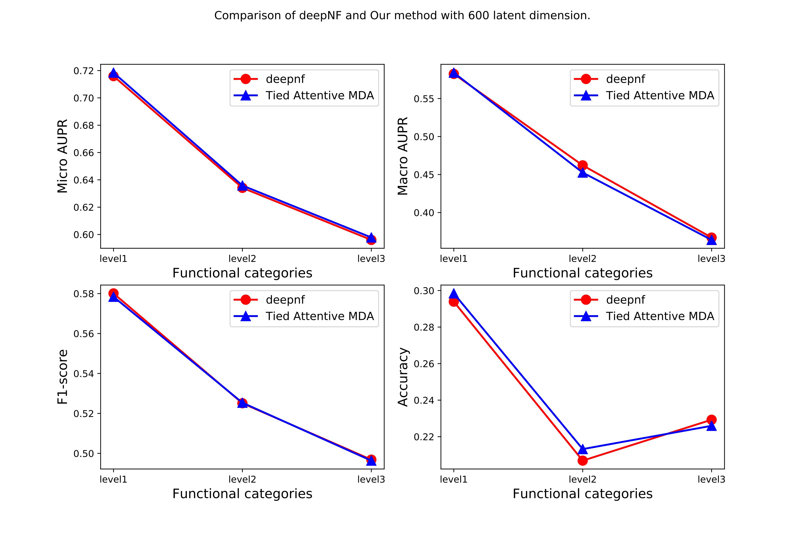
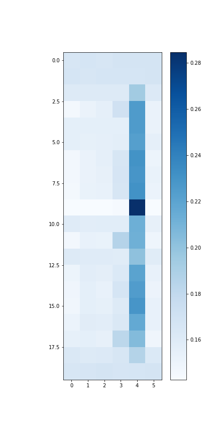

Protein function prediction with Multimodal Tied Autoencoders
============================================
A PyTorch implementation of Multimodal Tied Autoencoder.

### Abstract

<p align="justify">
Recent methdos such as deepnf use multimodal autoencoder to learn the represenation for each proteins. The state-of-the-art method have hundreds of millions of parameters to integrate multiple networks. In this project, we propose a multimodal tied autoencoders that constrain the decoder to share parameters with encoders. 
</p>

### Requirements
The codebase is implemented in Python 3.6.9. package versions used for development are just below.
```
tqdm              4.28.1
numpy             1.15.4
pandas            0.23.4
texttable         1.5.0
scipy             1.1.0
argparse          1.1.0
torch             0.4.1
```
### Datasets
- The interaction networks of Yeast and Human are collected from the STRING database v9.1.
- The functional labels for yeast are obtained from Munich Information Center for Protein Sequences (MIPS). The functional categories in MIPS are organized in a three-layered hierarchy.
- The functional labels for human are obtained from Gene Ontology database. The GO terms for human are grouped to obtain three distinct levels of functional categories for different specificities.


#### Preprocessing
To obtain global structure information, we perform random walk with restart followed by  Positive Pointwise Mutual Information.
```
Adjacency matrix A -> Random walk with restart (RWR) -> Positive Pointwise Mutual Information (PPMI) -> feature matrix X
```

Presenting it as python code:
```python
X = PPMI(RWR(A))
```


| **Network Type**| **Yeast** | **Human** |
| --- | --- |--- |
| Co-expression | 314,013 |1,576,332 |
| cooccurence | 2,664 | 36,128 |
| database | 33,486 | 319,004 |
| experimental | 219,995 | 618,574 |
| fusion | 1,361 | 3760 |
| neighborhood | 45,610 | 104958 |

| **Dataset**| **category** | **# number of labels** |
| --- | --- |--- |
|  | level-1 | 17 |
| Yeast | level-2 | 74 |
|  | level-3 | 154 |

| **Dataset**|**category**|**Biological Process**|**Cellular Component**|**Molecular Function**|
| --- | --- | --- | --- | --- | 
|  | 11-30 | 262| 82 | 153|
| Human | 31-100 |  100| 46| 72|
|  | 101-300 | 28  | 20 | 18|

### Options
Training the model is handled by the `main.py` script which provides the following command line arguments.

#### Input and output options
```
  --data-folder         STR    The data folder        Default is `data/`.
  --dataset             STR    The name of dataset    Default is `yeast`.
  --annotations-path    STR    Functional labels.     Default is `annotations/`.
  --networks-path       STR    Network datasets.      Default is `networks/`.
```
#### Model options
```
  --attn-type         STR     Type of attention              Default is `softmax`.               
  --seed              INT     Random seed.                   Default is 42.
  --epochs            INT     Number of training epochs.     Default is 20.
  --early-stopping    INT     Early stopping rounds.         Default is 10.
  --training-size     INT     Training set size.             Default is 1500.
  --validation-size   INT     Validation set size.           Default is 500.
  --learning-rate     FLOAT   Adam learning rate.            Default is 0.001.
  --dropout           FLOAT   Dropout rate value.            Default is 0.5.
  --hidden-size       INT     Layer sizes (Hidden).          Default is 2000. 
  --latent-size       INT     Layer sizes (LATENT).          Default is 600.
  --use-cuda          BOOL    Flag to use cuda               Default is False.
```
### Examples
The following commands learn a neural network and score on the test set. Training a model on the default dataset.
```
python main.py
```


Training a model for a 100 epochs.
```
python main.py --epochs 100
```
Increasing the learning rate and the dropout.
```
python main.py --learning-rate 0.1 --dropout 0.9
```
Training a model with latent-size 64:
```
python main.py --latent-size 64 
```
Training with cuda:
```
python main.py --use-cuda
```

### Results
The comparison of the model's performance with the SOTA method.


| **Model**| **# number of parameters** |
| --- | --- |
|  DeepNF | 312 millions |
| TiedDeepNF | 82 millions |

Our model shows similar performance with 230 millions less parameters.

<p align="center">
  
</p>

The attention map that indicates the weights given to different networks during feature learning.

<p align="center">
  
</p>
